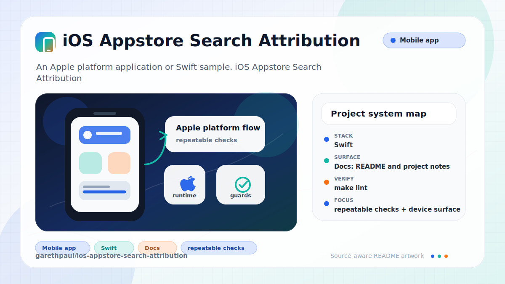

# ios-appstore-search-attribution

<!-- README-OVERVIEW-IMAGE -->


## Overview

`garethpaul/ios-appstore-search-attribution` is an Apple platform application or Swift sample. iOS Appstore Search Attribution Sample App

This README is based on the checked-in source, manifests, scripts, and repository metadata on the `master` branch. The project language mix found during review was: Swift (2).

## Repository Contents

- `CHANGES.md` - concise history of maintenance changes
- `Makefile` - local verification entry point
- `README.md` - project overview and local usage notes
- `ios-search-ads-sample` - source or example code
- `ios-search-ads-sample.xcodeproj` - Xcode project file
- `SECURITY.md` - security reporting and disclosure guidance
- `scripts/check-baseline.py` - static attribution privacy verifier
- `VISION.md` - project direction and maintenance guardrails

Additional scan context:

- Source directories: ios-search-ads-sample
- Dependency and build manifests: none detected
- Entry points or build surfaces: `make check`, ios-search-ads-sample.xcodeproj
- Test-looking files: no obvious test files detected

## Getting Started

### Prerequisites

- Git
- macOS with Xcode for building Apple platform projects
- Python 3 for local static verification on non-macOS hosts

### Setup

```bash
git clone https://github.com/garethpaul/ios-appstore-search-attribution.git
cd ios-appstore-search-attribution
make check
```

The setup commands above validate the static baseline. Full attribution behavior still needs a compatible iOS environment and Apple framework support.

## Running or Using the Project

- Open `ios-search-ads-sample.xcodeproj` in Xcode, choose the app or sample scheme, and run it on the matching simulator/device.
- Tap the attribution button in the sample app to request Search Ads attribution data through `ADClient`; the button shows an in-flight disabled state, the response stays local-only, and completion UI updates return to the main queue.
- Do not log, store, upload, or add segment behavior for attribution responses without a dedicated privacy design and user consent.

## Testing and Verification

Run the local static baseline:

```bash
make check
```

The baseline runs `scripts/check-baseline.py`, parses plist/storyboard/project XML, checks Swift 3 and iOS 10 project context, verifies the user-triggered ADClient request flow, requires the in-flight disabled button title, keeps attribution completion UI updates on the main queue, and guards against launch-time attribution requests, duplicate requests, attribution logging, storage, network upload, or segment updates.

For full legacy verification on macOS, use Xcode's test action or `xcodebuild test` with the appropriate scheme and destination.

When the required SDK or runtime is unavailable, use static checks and source review first, then verify on a machine that has the matching platform toolchain.

## Configuration and Secrets

- No required secret or credential file was identified in the repository scan. If you add integrations later, keep secrets out of git.

## Security and Privacy Notes

- Review changes touching network requests, sockets, or service endpoints; examples from the scan include ios-search-ads-sample/Info.plist.
- Review changes touching file, media, JSON, XML, CSV, OCR, or data parsing; examples from the scan include ios-search-ads-sample/Info.plist.
- Attribution responses can contain sensitive device and campaign context. Keep attribution response handling local-only, user-triggered, and documented.

## Maintenance Notes

- This looks like an Apple platform project or sample. Xcode, Swift, CocoaPods, and deployment target versions may need to match the original project era.
- See `SECURITY.md` for vulnerability reporting and safe research guidance.
- See `VISION.md` for project direction and contribution guardrails.
- Run `make check` before pushing changes to Swift sources, plist/storyboard files, project metadata, or attribution behavior.

## Contributing

Keep changes small and tied to the project that is already present in this repository. For code changes, document the toolchain used, avoid committing generated dependency directories or local configuration, and update this README when setup or verification steps change.
