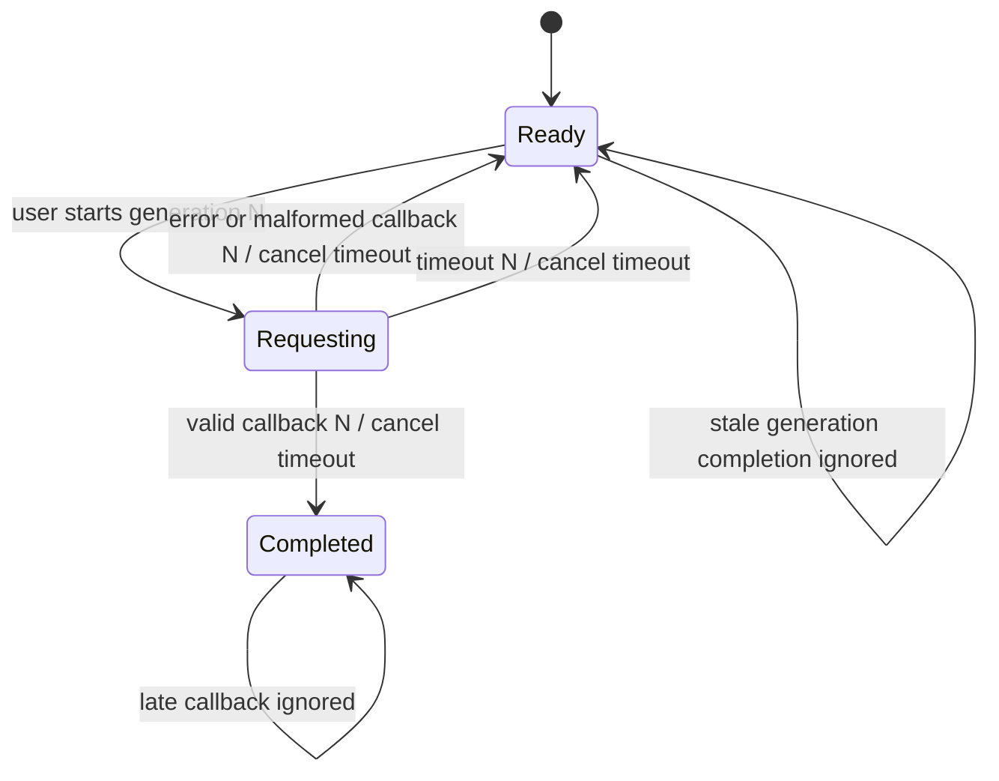

# Attribution Request Completion Timeout

## Summary

Bound each user-triggered `ADClient` request so a missing completion cannot
leave the attribution action disabled forever. The active generation should
return to the existing retry state after a deadline, while normal and stale
completions remain safe.

## Problem Frame

The controller sets in-flight state before invoking the deprecated iAd client
and clears it only inside the completion handler. If the service never invokes
that handler, the user sees a permanent requesting state and cannot retry.

## Requirements

- R1. Schedule one cancellable timeout for each accepted request generation.
- R2. Route active-generation timeout delivery through the same retry state as
  errors or malformed payloads.
- R3. Cancel and clear the timeout before applying an accepted terminal result.
- R4. Centralize terminal state so callback and timeout paths share generation,
  in-flight, button, accessibility, and completion semantics.
- R5. Preserve weak captures, main-queue UI mutation, local-only payload
  handling, Boolean field validation, and existing dependency/project policy.
- R6. Add mutation-sensitive static contracts and truthful completed evidence.

## High-Level Technical Design

The sketch is directional. A weakly captured, cancellable main-queue work item
owns the deadline, while one terminal helper remains the authority for state.

## Key Technical Decisions

- KTD1. Use `DispatchWorkItem` and `asyncAfter` because the project already uses
  modern Grand Central Dispatch and weak closure capture.
- KTD2. Convert payload validation to a Boolean terminal outcome before entering
  centralized main-queue state mutation.
- KTD3. Keep a named 30-second policy constant and generation payload so the
  deadline and race contract are visible to static validation.
- KTD4. Treat cancellation as an optimization; generation and in-flight guards
  remain authoritative if queued timeout work is delivered late.

## Scope Boundaries

- Do not migrate iAd to AdServices, launch `ADClient`, or claim runtime service
  behavior from Linux or hosted CI.
- Do not log, persist, upload, or segment attribution payloads or errors.
- Do not change Xcode metadata, deployment targets, signing, or public API.

## Implementation Units

### U1. Centralize bounded terminal state

- **Goal:** Ensure every request reaches completed or retry state within a
  bounded interval.
- **Files:** `ios-search-ads-sample/ViewController.swift`
- **Design:** Retain one timeout work item, schedule it after request state is
  established, cancel it in an accepted terminal helper, and route validated
  callback outcomes and timeout failure through that helper.
- **Test scenarios:** Valid Boolean payload completes; error, missing version,
  wrong field type, and timeout retry; stale timeout or callback cannot change a
  newer generation; duplicate action remains ignored while in flight.

### U2. Enforce lifecycle and evidence contracts

- **Goal:** Make removal, reordering, or divergence of timeout behavior fail the
  canonical gate.
- **Files:** `scripts/check-baseline.py`
- **Design:** Verify policy and work-item state, weak scheduling, source order,
  centralized callback delegation, cancellation, generation guards, docs, and
  completed plan evidence.
- **Test scenarios:** Isolated mutations removing timeout state, scheduling,
  cancellation, weak capture, failure routing, or plan evidence are rejected.

### U3. Document the recovery boundary

- **Goal:** Keep maintainers clear on retry behavior, privacy, validation, and
  platform limitations.
- **Files:** `AGENTS.md`, `CHANGES.md`, `README.md`, `SECURITY.md`, `VISION.md`,
  `docs/plans/2026-06-18-001-fix-attribution-request-timeout-plan.md`
- **Design:** Record timeout recovery and late-completion rejection without
  claiming live iAd execution.
- **Test scenarios:** Missing guidance, stale status, placeholder verification,
  and removed mutation evidence fail the baseline.

## Risks and Dependencies

- The 30-second interval is a conservative sample policy, not an iAd service
  guarantee.
- Cancelling a queued work item is not the sole safety mechanism; the terminal
  helper must continue to reject stale or duplicate delivery.
- End-to-end behavior still requires a compatible SDK/device environment or a
  separately reviewed AdServices migration.

## Acceptance Examples

- AE1. A request with no completion returns to announced retry state after the
  deadline.
- AE2. A valid completion before the deadline cancels timeout work and leaves
  the button completed and disabled.
- AE3. A timed-out generation's late callback cannot overwrite a newer request.

## Verification

- Run all Make aliases and the canonical gate from repository and external
  directories.
- Run maintained Python, plist, storyboard, project, workflow, and Swift source
  contracts with the existing platform boundary.
- Reject six isolated lifecycle and evidence mutations.
- Audit the exact stacked diff, artifacts, conflict markers, modes, and
  credential-shaped additions before shipping.

## Open Questions

None block implementation. Compatible-device observations may justify a future
timeout-policy adjustment without changing the lifecycle design.
